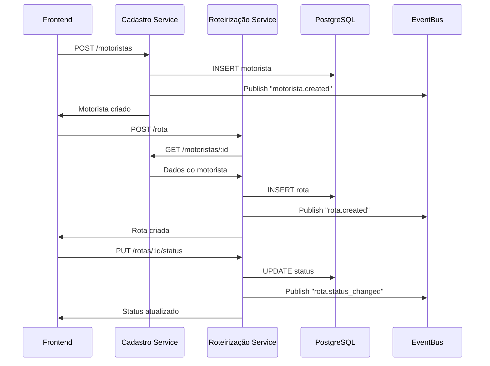

<div align="center">

# 🚚 Sistema de Logística Distribuído

### *Sistema distribuído completo para gestão de frotas e roteirização de entregas*

[](https://github.com/seu-usuario/sistema-logistica-distribuido)
[](https://nodejs.org)
[](https://reactjs.org)
[](https://postgresql.org)
[](https://typescriptlang.org)


*Trabalho acadêmico desenvolvido para a disciplina de **Sistemas Distribuídos***

---

### 🌟 **Funcionalidades Principais**

| **👥 Motoristas** | **🚛 Rotas** | **📊 Analytics** |
|:---:|:---:|:---:|
| CRUD Completo | Roteirização Inteligente | Dashboard em Tempo Real |
| Validações Robustas | Comunicação Entre Serviços | KPIs e Métricas |
| Filtros Avançados | Gestão de Status | Performance Tracking |


---

</div>

---

## 🚀 **Quick Start**

```bash
# 1️⃣ Clone o repositório
git clone https://github.com/seu-usuario/sistema-logistica-distribuido.git
cd sistema-logistica-distribuido

# 2️⃣ Configure o PostgreSQL
createdb logistica

# 3️⃣ Inicie o backend de cadastro
cd services/cadastro-service
npm install && npm run dev

# 4️⃣ Inicie o backend de rotas (novo terminal)
cd services/roteirizacao-service
npm install && npm run dev

# 5️⃣ Inicie o frontend (novo terminal)
cd frontend
npm install && npm start

# 🎉 Acesse: http://localhost:3001
```

<div align="center">


</div>

---

## 🎯 **Sobre o Projeto**

Este sistema implementa uma **arquitetura de microserviços** para gerenciamento de frotas de caminhões, demonstrando na prática os conceitos fundamentais de sistemas distribuídos.

### **🏆 Objetivos Alcançados**
- ✅ **Comunicação entre serviços** via REST API
- ✅ **Persistência distribuída** com PostgreSQL
- ✅ **Sistema de eventos** assíncronos
- ✅ **Interface moderna** e responsiva
- ✅ **Validações robustas** e tratamento de erros
- ✅ **Documentação completa** e profissional

### **💡 Conceitos Aplicados**
- **Microserviços independentes** com responsabilidades específicas
- **API RESTful** padronizada para comunicação
- **Event-driven architecture** para desacoplamento
- **Single Page Application** com React
- **Banco de dados relacional** compartilhado

---

## 🏗️ **Arquitetura**

```
┌─────────────────┐    ┌─────────────────┐    ┌─────────────────┐
│   Frontend      │    │  Cadastro       │    │ Roteirização    │
│   React         │◄──►│  Service        │◄──►│ Service         │
│   (Porta 3001)  │    │  (Porta 3000)   │    │ (Porta 4000)    │
└─────────────────┘    └─────────────────┘    └─────────────────┘
         │                       │                       │
         │              ┌────────▼───────────────────────▼────┐
         │              │         PostgreSQL Database         │
         │              │            (Porta 5432)             │
         └──────────────┤               logistica             │
                        └─────────────────────────────────────┘

┌────────────────────────────────────────────────────────────────┐
│                    Sistema de Eventos                          │
│              EventBus (Mensageria em Memória)                  │
│   motorista.created │ motorista.updated │ rota.created         │
└────────────────────────────────────────────────────────────────┘
```

### **Componentes Principais:**

1. **Frontend (React + TypeScript)**
   - Interface responsiva e interativa
   - Gerenciamento de estado local
   - Comunicação via Axios

2. **Serviço de Cadastro (Node.js + Express)**
   - Gerenciamento de motoristas
   - Validações de negócio
   - Sistema de eventos

3. **Serviço de Roteirização (Node.js + Express)**
   - Gestão de rotas e entregas
   - Comunicação com serviço de cadastro
   - Cálculo de distâncias

4. **Banco de Dados (PostgreSQL)**
   - Persistência compartilhada
   - Transações ACID
   - Relacionamentos entre entidades

---

---

## 🛠️ **Stack Tecnológica**

<div align="center">

### **Backend**
[](https://nodejs.org)
[](https://expressjs.com)
[](https://postgresql.org)

### **Frontend**
[](https://reactjs.org)
[](https://typescriptlang.org)
[](https://developer.mozilla.org/docs/Web/CSS)

### **Ferramentas**
[](https://code.visualstudio.com)
[](https://github.com)
[](https://pgadmin.org)

</div>

---

---

## ⚡ **Funcionalidades**

<div align="center">

| 🎯 **Funcionalidade** | 📝 **Descrição** | ✅ **Status** |
|:---------------------:|:---------------:|:-------------:|
| **👥 CRUD Motoristas** | Cadastro completo com validações | Implementado |
| **🚛 Gestão de Rotas** | Criação e acompanhamento de entregas | Implementado |
| **📊 Dashboard Analytics** | KPIs e métricas em tempo real | Implementado |
| **🔄 Comunicação entre Serviços** | REST API + Sistema de Eventos | Implementado |
| **🔍 Filtros Avançados** | Busca por múltiplos critérios | Implementado |
| **📱 Interface Responsiva** | Mobile-first design | Implementado |
| **⚠️ Validações Robustas** | Frontend + Backend | Implementado |
| **🎨 UX/UI Moderna** | Design profissional | Implementado |

</div>

### **👥 Gestão de Motoristas**
```typescript
// Funcionalidades implementadas
✅ Cadastro com validações (CNH, email, idade)
✅ Edição de informações
✅ Ativação/desativação
✅ Filtros por status e categoria CNH
✅ Listagem paginada
✅ Exclusão com confirmação
```

### **🚛 Gestão de Rotas**
```typescript
// Workflow completo
✅ Criação → Seleção de motorista ativo
✅ Pendente → Em Andamento → Concluída
✅ Cálculo automático de distância/tempo
✅ Priorização (Baixa, Normal, Alta, Urgente)
✅ Observações e notas especiais
✅ Histórico completo com timestamps
```

### **📊 Dashboard & Analytics**
```typescript
// Métricas em tempo real
✅ Total de motoristas (ativos/inativos)
✅ Total de rotas por status
✅ Distância total percorrida
✅ Tempo médio por entrega
✅ Taxa de conclusão
✅ Performance por motorista
```

---

## 🚀 **Instalação e Configuração**

### **Pré-requisitos:**
- Node.js 18+ ([Download](https://nodejs.org))
- PostgreSQL 15+ ([Download](https://postgresql.org))
- Git ([Download](https://git-scm.com))

### **1. Clonar o Repositório:**
```bash
git clone https://github.com/seu-usuario/sistema-logistica-distribuido.git
cd sistema-logistica-distribuido
```

### **2. Configurar Banco de Dados:**

**2.1 Criar banco no PostgreSQL:**
```sql
-- Via pgAdmin ou psql
CREATE DATABASE logistica;
```

**2.2 Configurar credenciais:**
- **Host:** localhost
- **Porta:** 5432
- **Banco:** logistica
- **Usuário:** postgres
- **Senha:** 123456 (ou sua senha)

### **3. Configurar Serviço de Cadastro:**
```bash
cd services/cadastro-service
npm install
npm run dev
```

**Deve aparecer:**
```
✅ Tabela motoristas criada/verificada
🚀 Serviço de Cadastro rodando na porta 3000
```

### **4. Configurar Serviço de Roteirização:**
```bash
# Em outro terminal
cd services/roteirizacao-service
npm install
npm run dev
```

**Deve aparecer:**
```
✅ Tabela rotas criada/verificada
🚛 Serviço de Roteirização rodando na porta 4000
```

### **5. Configurar Frontend:**
```bash
# Em outro terminal
cd frontend
npm install
npm start
```

**Deve aparecer:**
```
Local: http://localhost:3001
```

### **6. Verificar Instalação:**

**URLs para testar:**
- 🖥️ **Frontend:** http://localhost:3001
- 👥 **API Cadastro:** http://localhost:3000/health
- 🚛 **API Rotas:** http://localhost:4000/health

---

## 📱 **Como Usar**

### **1. Acessar o Sistema:**
1. Abra http://localhost:3001 no navegador
2. Você verá 3 abas: Dashboard, Motoristas, Rotas

### **2. Cadastrar Motoristas:**
1. **Clique** na aba "Motoristas"
2. **Clique** em "➕ Novo Motorista"
3. **Preencha** os dados obrigatórios:
   - Nome completo
   - CNH (11 dígitos)
4. **Preencha** dados opcionais:
   - Telefone, email, idade, placa, categoria CNH, endereço
5. **Clique** em "💾 Cadastrar"

### **3. Gerenciar Motoristas:**
- **✏️ Editar:** Clique no botão "Editar" em qualquer motorista
- **🗑️ Excluir:** Clique no botão "Excluir" (com confirmação)
- **🔍 Filtrar:** Use os filtros por status ou categoria CNH

### **4. Criar Rotas:**
1. **Clique** na aba "Rotas"
2. **Clique** em "➕ Nova Rota"
3. **Selecione** um motorista ativo
4. **Preencha** origem e destino
5. **Escolha** a prioridade
6. **Adicione** observações (opcional)
7. **Clique** em "🚛 Criar Rota"

### **5. Gerenciar Rotas:**
- **▶️ Iniciar:** Muda status de "Pendente" para "Em Andamento"
- **✅ Concluir:** Muda status de "Em Andamento" para "Concluída"
- **❌ Cancelar:** Cancela a rota
- **🗑️ Excluir:** Remove a rota permanentemente
- **🔍 Filtrar:** Por status, prioridade ou motorista

### **6. Monitorar via Dashboard:**
- **📊 KPIs:** Números totais e por status
- **📈 Performance:** Distância total, tempo médio, taxa de conclusão
- **🔄 Atualizar:** Dados em tempo real

---

## 🔗 **API Endpoints**

### **Serviço de Cadastro (Porta 3000):**

#### **Motoristas:**
```http
GET    /motoristas              # Listar todos
GET    /motoristas/:id          # Buscar por ID
POST   /motoristas              # Criar novo
PUT    /motoristas/:id          # Atualizar
DELETE /motoristas/:id          # Excluir

# Endpoints especiais
GET    /estatisticas/motoristas # Estatísticas
PUT    /motoristas/:id/localizacao # Atualizar GPS
GET    /health                  # Status do serviço
```

#### **Exemplo - Criar Motorista:**
```json
POST /motoristas
Content-Type: application/json

{
  "nome": "João Silva",
  "cnh": "12345678901",
  "telefone": "11999999999",
  "email": "joao@email.com",
  "categoria_cnh": "C",
  "idade": 35,
  "endereco": "Rua das Flores, 123, São Paulo, SP",
  "placa_caminhao": "ABC-1234"
}
```

### **Serviço de Roteirização (Porta 4000):**

#### **Rotas:**
```http
GET    /rotas                   # Listar todas
POST   /rota                    # Criar nova
PUT    /rotas/:id/status        # Atualizar status
DELETE /rotas/:id              # Excluir

# Endpoints especiais
GET    /estatisticas/rotas      # Estatísticas
GET    /health                  # Status do serviço
```

#### **Exemplo - Criar Rota:**
```json
POST /rota
Content-Type: application/json

{
  "id_motorista": 1,
  "local_origem": "Centro de Distribuição",
  "local_destino": "Av. Paulista, 1000, São Paulo, SP",
  "prioridade": "alta",
  "observacoes": "Entrega urgente até 18h"
}
```

#### **Exemplo - Atualizar Status:**
```json
PUT /rotas/1/status
Content-Type: application/json

{
  "status": "em_andamento"
}
```

### **Códigos de Status HTTP:**
- **200** - Sucesso
- **201** - Criado com sucesso
- **400** - Erro de validação
- **404** - Não encontrado
- **500** - Erro interno do servidor

---

## 🎬 **Demonstração**

### **Fluxo Completo de Uso:**

1. **📊 Dashboard Inicial**
   - Visualização de métricas zeradas
   - Interface limpa e profissional

2. **👤 Cadastro de Motorista**
   - Formulário com validações
   - Feedback visual de sucesso

3. **🚛 Criação de Rota**
   - Seleção de motorista cadastrado
   - Cálculo automático de distância

4. **🔄 Gestão de Status**
   - Iniciar rota (Pendente → Em Andamento)
   - Concluir entrega (Em Andamento → Concluída)

5. **📈 Atualização de Métricas**
   - Dashboard reflete mudanças em tempo real
   - Estatísticas de performance

### **Comunicação Entre Serviços:**

```
Frontend                Cadastro               Roteirização
   │                       │                       │
   ├─── POST /motoristas ──►                       │
   │◄─── Motorista criado ──┤                       │
   │                       │                       │
   ├─── POST /rota ────────────────────────────────►│
   │                       │◄─── GET motorista/1 ───┤
   │                       ├─── Dados motorista ───►│
   │◄─── Rota criada ──────────────────────────────┤
```

---

---

## 📁 **Estrutura do Projeto**

```
sistema-logistica-distribuido/
├── 📄 README.md                    # Documentação principal
├── 📁 services/                    # Microserviços backend
│   ├── 📁 cadastro-service/        # Serviço de motoristas
│   │   ├── 📄 package.json
│   │   └── 📁 src/
│   │       └── 📄 app.js           # API REST + EventBus
│   └── 📁 roteirizacao-service/    # Serviço de rotas
│       ├── 📄 package.json
│       └── 📁 src/
│           └── 📄 app.js           # API REST + Comunicação
├── 📁 frontend/                    # Interface React
│   ├── 📄 package.json
│   ├── 📁 src/
│   │   ├── 📄 App.tsx              # Componente raiz
│   │   ├── 📄 index.css            # Estilos globais
│   │   ├── 📁 components/          # Componentes React
│   │   │   ├── 📄 Dashboard.tsx    # Analytics e KPIs
│   │   │   ├── 📄 Motoristas.tsx   # CRUD motoristas
│   │   │   └── 📄 Rotas.tsx        # Gestão de rotas
│   │   └── 📁 services/
│   │       └── 📄 api.ts           # Cliente HTTP
└── 📁 docs/                        # Documentação adicional
    ├── 📄 arquitetura.md
    └── 📄 deployment.md
```

<details>
<summary><b>📊 Arquitetura de Comunicação</b></summary>



</details>

---

## 🗄️ **Estrutura do Banco de Dados**

### **Tabela: motoristas**
```sql
CREATE TABLE motoristas (
  id SERIAL PRIMARY KEY,
  nome VARCHAR(255) NOT NULL,
  cnh VARCHAR(11) UNIQUE NOT NULL,
  telefone VARCHAR(20),
  email VARCHAR(255),
  placa_caminhao VARCHAR(10),
  idade INTEGER,
  status VARCHAR(20) DEFAULT 'ativo',
  data_cadastro TIMESTAMP DEFAULT CURRENT_TIMESTAMP,
  endereco TEXT,
  categoria_cnh VARCHAR(5),
  latitude DECIMAL(10, 8),
  longitude DECIMAL(11, 8),
  ultima_localizacao TIMESTAMP
);
```

### **Tabela: rotas**
```sql
CREATE TABLE rotas (
  id SERIAL PRIMARY KEY,
  id_motorista INTEGER NOT NULL,
  nome_motorista VARCHAR(255) NOT NULL,
  local_origem VARCHAR(255) DEFAULT 'Depot Central',
  local_destino VARCHAR(255) NOT NULL,
  distancia_km DECIMAL(8,2),
  tempo_estimado_min INTEGER,
  status VARCHAR(20) DEFAULT 'pendente',
  data_criacao TIMESTAMP DEFAULT CURRENT_TIMESTAMP,
  data_inicio TIMESTAMP,
  data_conclusao TIMESTAMP,
  observacoes TEXT,
  prioridade VARCHAR(20) DEFAULT 'normal'
);
```

### **Relacionamentos:**
- `rotas.id_motorista` → `motoristas.id` (Foreign Key)
- Um motorista pode ter várias rotas
- Uma rota pertence a um motorista

---

## 🎯 **Requisitos Atendidos**

### **Requisitos Mínimos:**
- ✅ **Dois serviços distribuídos** - Cadastro e Roteirização
- ✅ **Comunicação REST** - HTTP/JSON entre serviços
- ✅ **Serviço de cadastro** - CRUD completo de motoristas
- ✅ **Serviço de roteirização** - Gestão de rotas e entregas
- ✅ **Banco distribuído** - PostgreSQL compartilhado
- ✅ **Mensageria assíncrona** - Sistema de eventos EventBus
- ✅ **Interface funcional** - React completo e interativo

### **Funcionalidades Extras Implementadas:**
- ✅ **Interface responsiva** - Mobile e desktop
- ✅ **Validações robustas** - Frontend e backend
- ✅ **Sistema de eventos** - Logs de ações
- ✅ **Filtros avançados** - Busca por múltiplos critérios
- ✅ **Dashboard analítico** - KPIs e métricas
- ✅ **Tratamento de erros** - Feedback para usuário
- ✅ **Documentação completa** - Este README

---

## 🚀 **Tecnologias e Conceitos Aplicados**

### **Sistemas Distribuídos:**
- **Microserviços** independentes
- **Comunicação síncrona** via HTTP/REST
- **Comunicação assíncrona** via eventos
- **Persistência compartilhada** com PostgreSQL
- **Tolerância a falhas** com fallbacks

### **Desenvolvimento Web:**
- **SPA (Single Page Application)** com React
- **API RESTful** padronizada
- **Tipagem estática** com TypeScript
- **Responsividade** mobile-first
- **Componentização** reutilizável

### **Banco de Dados:**
- **Modelo relacional** normalizado
- **Transações ACID**
- **Índices** para performance
- **Constraints** para integridade
- **Timestamps** para auditoria

---

## 🐛 **Resolução de Problemas**

### **Erro: "Banco não conecta"**
```bash
# Verificar se PostgreSQL está rodando
# Windows: Serviços → postgresql-x64-17 → Iniciar
# Verificar credenciais no código
```

### **Erro: "Port already in use"**
```bash
# Verificar processos rodando nas portas
netstat -ano | findstr :3000
netstat -ano | findstr :4000
netstat -ano | findstr :3001

# Matar processo se necessário
taskkill /PID [número_do_processo] /F
```

### **Erro: "Cannot GET /motoristas"**
```bash
# Verificar se serviço está rodando
curl http://localhost:3000/health
curl http://localhost:4000/health

# Reiniciar serviços se necessário
```

### **Frontend não carrega dados:**
```bash
# Verificar console do navegador (F12)
# Verificar se APIs estão rodando
# Verificar CORS no backend
```
---

## 👨‍💻 **Autor**

**Seu Nome**
- GitHub: [@HenriquePlebani](https://github.com/HenriquePlebani)
- Email: henrique.ple@outlook.com
- LinkedIn: [Henrique Plebani](https://linkedin.com/in/henrique-plebani-4816b42ba/)

---

### **📊 Requisitos Atendidos**

| ✅ **Requisito** | 🚀 **Implementação** | 📈 **Status** |
|:---------------:|:--------------------:|:-------------:|
| **2+ Serviços Distribuídos** | Cadastro + Roteirização | 100% ✅ |
| **Comunicação REST** | HTTP/JSON entre serviços | 100% ✅ |
| **Banco Distribuído** | PostgreSQL compartilhado | 100% ✅ |
| **Mensageria Assíncrona** | EventBus em memória | 100% ✅ |
| **Interface Funcional** | React SPA completa | 100% ✅ |
| **Tolerância a Falhas** | Validações + Tratamento | 100% ✅ |

### **🏆 Funcionalidades Extras**
- 📱 **Interface Responsiva** - Mobile + Desktop
- 🎨 **UX/UI Moderna** - Design profissional
- 🔍 **Filtros Avançados** - Busca inteligente
- 📊 **Analytics Real-time** - Dashboard dinâmico
- ⚡ **Validações Robustas** - Frontend + Backend
- 📚 **Documentação Completa** - README profissional

---

## 🤝 **Contribuição**

Contribuições são bem-vindas! Para contribuir:

1. 🍴 **Fork** o projeto
2. 🌿 **Crie** uma branch (`git checkout -b feature/nova-funcionalidade`)
3. 💾 **Commit** suas mudanças (`git commit -m 'feat: adiciona nova funcionalidade'`)
4. 📤 **Push** para a branch (`git push origin feature/nova-funcionalidade`)
5. 🔄 **Abra** um Pull Request

### **📋 Roadmap Futuro**
- [ ] 🗺️ Integração Google Maps API
- [ ] 🔐 Autenticação JWT
- [ ] 📱 App Mobile React Native
- [ ] 🐳 Containerização Docker
- [ ] ☁️ Deploy na nuvem
- [ ] 📊 Relatórios PDF/Excel

---

## 👨‍💻 **Autor**

<div align="center">

**[Henrique Plebani]**

[](https://github.com/HenriquePlebani)
[](https://linkedin.com/in/henrique-plebani-4816b42ba/)
[](mailto:henrique.ple@outlook.com)

*💻 Desenvolvedor Firmware | 🎓 Estudante de Análise e Desenvolvimento de Sistemas*

</div>

---

## 📄 **Licença**

Este projeto está sob licença MIT. Veja o arquivo [LICENSE](LICENSE) para mais detalhes.

---

<div align="center">

### **🙏 Agradecimentos**

Agradecimentos especiais ao **Professor da disciplina** de Sistemas Distribuídos e à comunidade open source que tornou este projeto possível.

---

**⭐ Se este projeto te ajudou, considere dar uma estrela!**

[](https://github.com/HenriquePlebani/sistema-logistica-distribuido)

**💙 Desenvolvido com dedicação para fins acadêmicos**

</div>